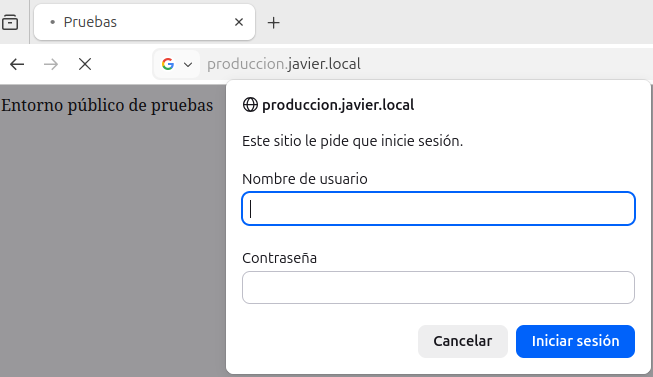
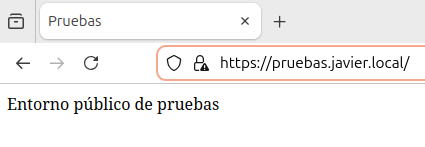
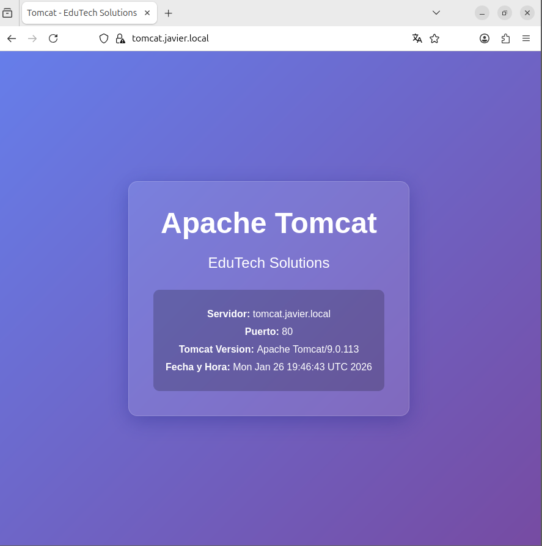
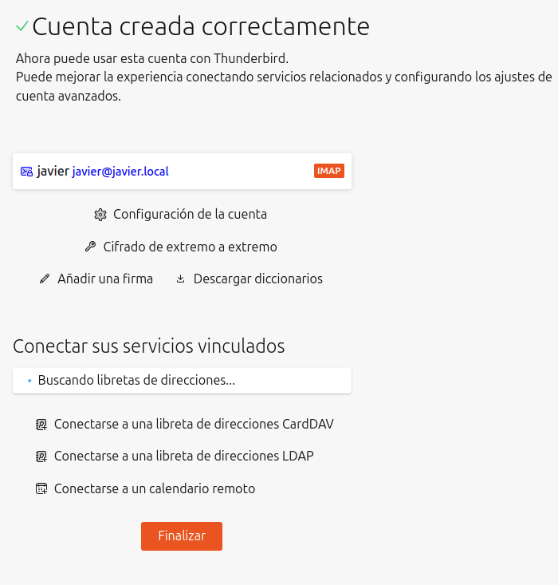
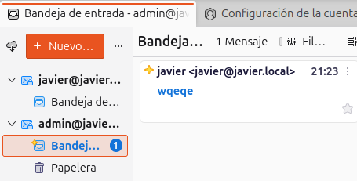
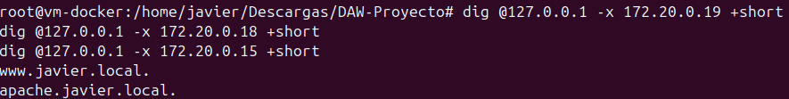

# Proyecto de Infraestructura DAW: EduTech Solutions

## Introducción y Objetivos
Este proyecto simula una infraestructura completa para una empresa ficticia (**EduTech Solutions**) o centro educativo. 

**Objetivos específicos:**
- Configuración de resolución de nombres (DNS) con redundancia (Maestro/Esclavo).
- Centralización de usuarios y autenticación mediante LDAP.
- Despliegue de servicios web seguros (HTTPS) tras un proxy inverso.
- Implementación de un sistema de correo electrónico completo.
- Integración de herramientas de gestión de proyectos corporativos (Kanboard).

## Índice
1. [Introducción y Objetivos](#introducción-y-objetivos)
2. [Diagrama de la Infraestructura](#diagrama-de-la-infraestructura)
3. [Descripción de cada servicio](#descripción-de-cada-servicio)
4. [Medidas de seguridad aplicadas](#medidas-de-seguridad-aplicadas)
5. [Servicio corporativo adicional: Kanboard](#servicio-corporativo-adicional-kanboard)
6. [Servidor de Correo e Integración LDAP](#servidor-de-correo-e-integración-ldap)
7. [Resolución DNS y Redundancia](#resolución-dns-y-redundancia)
8. [Uso de Docker](#uso-de-docker)
9. [Guía de despliegue](#guía-de-despliegue)
10. [Decisiones técnicas](#decisiones-técnicas)
11. [Posibles mejoras](#posibles-mejoras)
12. [Problemas encontrados y soluciones](#problemas-encontrados-y-soluciones)
13. [Conclusiones](#conclusiones)

## Diagrama de la Infraestructura

A continuación se presenta el diseño lógico de la red y la interconexión de los contenedores Docker:


## Descripción de cada servicio

| Servicio               | Contenedor                                             | IP                             | Descripción                                                                                                   |
| ---------------------- | ------------------------------------------------------ | ------------------------------ | ------------------------------------------------------------------------------------------------------------- |
| **DNS (Bind9)**        | `dns_javier` (Maestro)<br>`dns_slave_javier` (Esclavo) | `172.20.0.13`<br>`172.20.0.17` | Resolución de nombres para el dominio `javier.local`. El esclavo garantiza disponibilidad si el maestro cae.  |
| **Proxy Web (Apache)** | `apache_javier`                                        | `172.20.0.15`                  | Punto de entrada único. Gestiona VirtualHosts (`produccion`, `pruebas`, `tomcat`, `proyectos`) y termina SSL. |
| **Directorio (LDAP)**  | `ldap_javier`                                          | `172.20.0.16`                  | Servidor OpenLDAP para gestión centralizada de usuarios y grupos (Profesores, Alumnos).                       |
| **Correo**             | `mail_javier`                                          | `172.20.0.18`                  | Servidor Postfix/Dovecot integrado con LDAP para autenticación. Soporta IMAPS y SMTPS.                        |
| **Tomcat**             | `tomcat_javier`                                        | `172.20.0.14`                  | Servidor de aplicaciones Java, accesible solo a través del proxy Apache.                                      |
| **Kanboard**           | `kanboard_javier`                                      | `172.20.0.19`                  | Gestión de tareas y proyectos estilo Kanban.                                                                  |

### Pruebas de funcionamiento HTTPS y Web

Validación del acceso a los diferentes VirtualHosts servidos por Apache:

**Sitio de Producción (`produccion.javier.local`):**


**Sitio de Pruebas (`pruebas.javier.local`):**


**Integración con Tomcat (`tomcat.javier.local`):**


## Medidas de seguridad aplicadas

1.  **Cifrado SSL/TLS:** Todo el tráfico web importante (Kanboard, correo) está protegido mediante certificados autofirmados generados con OpenSSL.
2.  **Autenticación Centralizada:** Uso de LDAP para evitar duplicidad de contraseñas. Si un usuario cambia su clave en LDAP, afecta a correo y Kanboard.
3.  **Proxy Inverso:** Los servicios internos (Tomcat, Kanboard) no exponen sus puertos por defecto al exterior (salvo para administración específica), forzando el paso por Apache.
4.  **Usuarios no privilegiados:** Apache y Bind corren con usuarios específicos o configuraciones restringidas donde es posible.
5.  **Separación de datos:** Uso de volúmenes persistentes para evitar pérdida de datos al recrear contenedores.

## Servicio corporativo adicional: Kanboard
- **Integración:** Configurado para autenticar usuarios directamente contra el servidor OpenLDAP de la infraestructura.
- **Acceso:** Disponible en `https://proyectos.javier.local`.
- **Persistencia:** Los datos de la aplicación y plugins se guardan en volúmenes Docker.

**Captura de acceso exitoso a Kanboard:**


## Servidor de Correo e Integración LDAP
El servidor de correo utiliza los usuarios definidos en el directorio LDAP.

**Creación y verificación de cuenta:**


**Prueba de envío de correo:**


## Credenciales de Acceso

### Administración LDAP

| Servicio           | URL                   | Usuario                       | Contraseña |
| ------------------ | --------------------- | ----------------------------- | ---------- |
| **phpLDAPadmin**   | http://localhost:8080 | `cn=admin,dc=javier,dc=local` | `admin`    |
| **LDAP (directo)** | ldap://localhost:389  | `cn=admin,dc=javier,dc=local` | `admin`    |

### Kanboard (Gestión de Proyectos)

| URL                            | Usuario | Contraseña |
| ------------------------------ | ------- | ---------- |
| https://proyectos.javier.local | `admin` | `admin`    |

### Usuarios del Sistema (LDAP + Correo)

| Usuario  | Email               | Contraseña  | Grupo           | Descripción               |
| -------- | ------------------- | ----------- | --------------- | ------------------------- |
| `javier` | javier@javier.local | `root`      | profesores      | Profesor y administrador  |
| `chopy`  | chopy@javier.local  | `example`   | alumnos         | Estudiante DAW            |
| `ana`    | ana@javier.local    | `prof123`   | profesores      | Profesora de BBDD         |
| `pedro`  | pedro@javier.local  | `alumno123` | alumnos         | Estudiante DAW            |
| `admin`  | admin@javier.local  | `admin123`  | administradores | Administrador del sistema |

### Configuración Cliente de Correo

| Parámetro         | Valor                                             |
| ----------------- | ------------------------------------------------- |
| **Servidor IMAP** | mail.javier.local                                 |
| **Puerto IMAP**   | 993 (SSL) o 143 (STARTTLS)                        |
| **Servidor SMTP** | mail.javier.local                                 |
| **Puerto SMTP**   | 587 (STARTTLS) o 465 (SSL)                        |
| **Autenticación** | Contraseña normal                                 |
| **Usuario**       | nombre de usuario (ej: `javier`) o email completo |

## Resolución DNS y Redundancia
El sistema cuenta con un servidor maestro y un esclavo que sincronizan las zonas automáticamente.

**Prueba de resolución inversa:**


**Verificación de transferencia de zona (Copia Correcta):**


## Uso de Docker
Toda la infraestructura se define como código (IaC) mediante **Docker Compose**:
- **Redes:** Se utiliza una red bridge personalizada (`red_daw`) con direccionamiento IP estático para garantizar que la configuración DNS sea consistente.
- **Volúmenes:** Mapeo de configuraciones (`./conf`) y datos (`/var/lib...`) al host para facilitar la edición y persistencia.
- **Dockerfiles:** Se usan imágenes oficiales (`ubuntu/bind9`, `tomcat`) y personalizadas (`apache`, `correo`) donde se requiere instalar módulos extra o configuraciones complejas.

## Configuración DNS

### Servidor Maestro (172.20.0.13)

**Archivo de configuración:** `bind9/conf/named.conf`

```
options {
    directory "/var/cache/bind";
    allow-query { any; };
    recursion yes;
    forwarders { 8.8.8.8; 8.8.4.4; };
    dnssec-validation no;
};

zone "javier.local" { type master; file "/var/lib/bind/db.javier.local"; };
zone "0.20.172.in-addr.arpa" { type master; file "/var/lib/bind/db.172.20.0"; };
```

### Zona Directa: `javier.local`

**Archivo:** `bind9/zones/db.javier.local`

| Registro     | Tipo  | Valor             | Descripción        |
| ------------ | ----- | ----------------- | ------------------ |
| `ns1`        | A     | 172.20.0.13       | DNS Master         |
| `ns2`        | A     | 172.20.0.17       | DNS Slave          |
| `tomcat`     | A     | 172.20.0.14       | Servidor Tomcat    |
| `www`        | A     | 172.20.0.15       | Servidor Apache    |
| `ldap`       | A     | 172.20.0.16       | Servidor LDAP      |
| `mail`       | A     | 172.20.0.18       | Servidor Correo    |
| `proyectos`  | A     | 172.20.0.19       | Kanboard           |
| `produccion` | CNAME | www               | Alias producción   |
| `pruebas`    | CNAME | www               | Alias pruebas      |
| `@`          | MX 10 | mail.javier.local | Registro de correo |

### Zona Inversa: `0.20.172.in-addr.arpa`

**Archivo:** `bind9/zones/db.172.20.0`

| IP          | PTR                                   |
| ----------- | ------------------------------------- |
| 172.20.0.13 | ns1.javier.local                      |
| 172.20.0.14 | tomcat-server.javier.local            |
| 172.20.0.15 | apache.javier.local, www.javier.local |
| 172.20.0.16 | ldap-server.javier.local              |
| 172.20.0.17 | ns2.javier.local                      |
| 172.20.0.18 | mail.javier.local                     |
| 172.20.0.19 | proyectos.javier.local                |

### Servidor Esclavo (172.20.0.17)

Replica automáticamente las zonas del maestro mediante transferencia de zona (AXFR).

---

## Servidor Web Apache

### Configuración General

- **Imagen base:** `httpd:2.4`
- **Dockerfile:** `apache/Dockerfile`
- **SSL/TLS:** Habilitado en todos los VirtualHosts
- **Módulos activos:** `mod_ssl`, `mod_proxy`, `mod_proxy_http`, `mod_rewrite`

### VirtualHosts Configurados

#### 1. Redirección HTTP → HTTPS
**Archivo:** `apache/conf/extra/vhosts/00-redirect.conf`
- Todo el tráfico HTTP (puerto 80) se redirige a HTTPS

#### 2. Producción
**Archivo:** `apache/conf/extra/vhosts/10-produccion.conf`
- **URL:** https://produccion.javier.local
- **DocumentRoot:** `/usr/local/apache2/htdocs/produccion`
- **Características:** AllowOverride All, Indexes, FollowSymLinks
- **Logs:** `produccion_error.log`, `produccion_access.log`

#### 3. Pruebas
**Archivo:** `apache/conf/extra/vhosts/20-pruebas.conf`
- **URL:** https://pruebas.javier.local
- **DocumentRoot:** `/usr/local/apache2/htdocs/pruebas`
- **Características:** AllowOverride None, Indexes, FollowSymLinks
- **Logs:** `pruebas_error.log`, `pruebas_access.log`

#### 4. Tomcat (Proxy Inverso)
**Archivo:** `apache/conf/extra/vhosts/30-tomcat.conf`
- **URL:** https://tomcat.javier.local
- **Backend:** `http://tomcat:8080/`
- **Tipo:** Proxy inverso con terminación SSL
- **Logs:** `tomcat_error.log`, `tomcat_access.log`

#### 5. Kanboard (Proxy Inverso)
**Archivo:** `apache/conf/extra/vhosts/40-kanboard.conf`
- **URL:** https://proyectos.javier.local
- **Backend:** `http://kanboard:8081/`
- **Tipo:** Proxy inverso con terminación SSL
- **Logs:** `proyectos_error.log`, `proyectos_access.log`

### Componentes

- **MTA (SMTP):** Postfix
- **MDA/IMAP/POP3:** Dovecot
- **Autenticación:** LDAP (ou=Usuarios)
- **Almacenamiento:** Maildir en `/var/mail/vhosts`

### Puertos

| Puerto | Servicio   | Seguridad                   |
| ------ | ---------- | --------------------------- |
| 25     | SMTP       | STARTTLS                    |
| 465    | SMTPS      | TLS implícito               |
| 587    | Submission | STARTTLS obligatorio + AUTH |
| 110    | POP3       | STARTTLS                    |
| 143    | IMAP       | STARTTLS                    |
| 993    | IMAPS      | TLS implícito               |
| 995    | POP3S      | TLS implícito               |

### Seguridad Implementada

**Postfix (`correo/main.cf`):**
- TLS habilitado con certificado propio
- SASL autenticación vía Dovecot
- Solo usuarios autenticados pueden hacer relay
- Protocolos SSLv2/SSLv3 deshabilitados

**Dovecot (`correo/dovecot.conf`):**
- SSL requerido (`ssl = required`)
- TLS mínimo v1.2
- Plaintext auth deshabilitado
- Socket auth para Postfix SASL

### Archivos de Configuración

```
correo/
├── Dockerfile              # Imagen personalizada Ubuntu 22.04
├── main.cf                 # Configuración Postfix
├── dovecot.conf            # Configuración Dovecot
├── dovecot-ldap.conf.ext   # Autenticación LDAP Dovecot
├── ldap-users.cf           # Búsqueda LDAP Postfix
├── entrypoint.sh           # Script de inicio
└── certs/
    ├── mail.crt            # Certificado TLS
    ├── mail.key            # Clave privada TLS
    └── README.md
```

### Usuarios de Correo

Los usuarios de correo son los mismos del LDAP:
- `javier@javier.local`
- `chopy@javier.local`
- `ana@javier.local`
- `pedro@javier.local`
- `admin@javier.local`

### Configurar Cliente de Correo

**Servidor entrante (IMAP):**
- Servidor: `mail.javier.local`
- Puerto: 993 (IMAPS) o 143 (IMAP+STARTTLS)
- Seguridad: SSL/TLS
- Autenticación: Contraseña normal

**Servidor saliente (SMTP):**
- Servidor: `mail.javier.local`
- Puerto: 587 (Submission) o 465 (SMTPS)
- Seguridad: STARTTLS (587) o SSL/TLS (465)
- Autenticación: Contraseña normal


Cuenta IMAP configurada correctamente en el cliente.


Prueba de envío y recepción de correo exitosa.

---

## Certificados SSL/TLS

### Apache (Web)

- **Ubicación:** `apache/conf/server.crt`, `apache/conf/server.key`
- **CN:** `*.javier.local`
- **Uso:** produccion, pruebas, tomcat, proyectos

**Regenerar:**
```bash
openssl req -new -newkey rsa:2048 -days 365 -nodes -x509 \
  -keyout apache/conf/server.key \
  -out apache/conf/server.crt \
  -subj "/CN=*.javier.local" \
  -addext "subjectAltName=DNS:*.javier.local,DNS:javier.local"
```

### Correo (Mail)

- **Ubicación:** `correo/certs/mail.crt`, `correo/certs/mail.key`
- **CN:** `mail.javier.local`
- **Uso:** Postfix SMTP, Dovecot IMAP/POP3

**Regenerar:**
```bash
docker run --rm -v "${PWD}/correo/certs:/out" ubuntu:22.04 sh -c "\
  apt-get update >/dev/null && apt-get install -y openssl >/dev/null && \
  openssl req -new -newkey rsa:2048 -days 365 -nodes -x509 \
    -keyout /out/mail.key -out /out/mail.crt \
    -subj '/CN=mail.javier.local' \
    -addext 'subjectAltName=DNS:mail.javier.local' && \
  chmod 600 /out/mail.key && chmod 644 /out/mail.crt"
```

---

## Comandos de Prueba

### Verificar DNS

**Resolución directa:**
```bash
# Desde el host
dig @127.0.0.1 proyectos.javier.local +short
dig @127.0.0.1 mail.javier.local +short
dig @127.0.0.1 -t MX javier.local +short

# Desde contenedor
docker-compose exec dns dig @localhost proyectos.javier.local +short
```

**Resolución inversa:**
```bash
# Probar todas las IPs
for ip in 13 14 15 16 17 18 19; do
  echo "=== 172.20.0.$ip ==="
  dig @127.0.0.1 -x 172.20.0.$ip +short
done
```


Resultado de consultas PTR para las IPs de la red.

### Verificar Apache

```bash
# Probar HTTPS
curl -k https://produccion.javier.local
curl -k https://pruebas.javier.local
curl -k https://tomcat.javier.local
curl -k https://proyectos.javier.local

# Verificar certificado
openssl s_client -connect 127.0.0.1:443 -servername produccion.javier.local </dev/null
```


Página servida por el vhost de producción.


Página servida por el vhost de pruebas.


Acceso vía proxy inverso a Tomcat.


Acceso vía proxy inverso a Kanboard.

### Verificar Correo

```bash
# SMTP con STARTTLS
openssl s_client -starttls smtp -connect mail.javier.local:587

# SMTPS directo
openssl s_client -connect mail.javier.local:465

# IMAPS
openssl s_client -connect mail.javier.local:993

# POP3S
openssl s_client -connect mail.javier.local:995
```

### Verificar LDAP

```bash
# Buscar usuarios
docker-compose exec ldap ldapsearch -x -H ldap://localhost \
  -D "cn=admin,dc=javier,dc=local" -w admin \
  -b "ou=Usuarios,dc=javier,dc=local" "(objectClass=inetOrgPerson)"

# Buscar grupos
docker-compose exec ldap ldapsearch -x -H ldap://localhost \
  -D "cn=admin,dc=javier,dc=local" -w admin \
  -b "ou=Groups,dc=javier,dc=local" "(objectClass=posixGroup)"
```

---

## Guía de despliegue

### Requisitos
- Docker Desktop / Docker Engine
- Puertos libres: 80, 443, 8080, 8081, 53 (TCP/UDP).

### Pasos
1.  **Clonar repositorio:** `git clone ...`
2.  **Generar Certificados:** Ejecutar los comandos OpenSSL (ver scripts en carpeta `correo/certs` y `apache/conf`).
3.  **Configurar Hosts:** Añadir las entradas DNS en `/etc/hosts` o `C:\Windows\System32\drivers\etc\hosts`:
    ```text
    127.0.0.1 proyectos.javier.local mail.javier.local produccion.javier.local pruebas.javier.local tomcat.javier.local
    ```
4.  **Iniciar:** `docker-compose up -d --build`
5.  **Acceder:**
    *   Kanboard: `http://localhost:8081` o `https://proyectos.javier.local`
    *   LDAP Admin: `http://localhost:8080`

### Credenciales Rápidas
| Usuario        | Pass      | Rol                  |
| -------------- | --------- | -------------------- |
| `admin` (LDAP) | `admin`   | Administrador Global |
| `javier`       | `root`    | Profesor             |
| `chopy`        | `example` | Alumno               |

## Decisiones técnicas
- **Bind9 Slave:** Se implementó para demostrar la transferencia de zona AXFR y redundancia DNS, usando el formato `raw` por defecto de Bind para eficiencia.
- **LDAP como Source of Truth:** Se decidió no crear usuarios locales en los servicios (Kanboard, Mail) y delegar todo en LDAP para simular un entorno empresarial real.
- **Apache vs Nginx:** Se optó por Apache por su robustez en el manejo de módulos dinámicos y familiaridad en entornos educativos clásicos.

## Posibles mejoras
- **Backups Automáticos:** Scripts para crear copias de seguridad del LDAP y bases de datos de Kanboard (SQLite/MySQL) periódicamente.
- **Seguridad de Red:** Crear una red DMZ separada de la red de Base de Datos/Interna para mayor aislamiento.
- **Certificados Reales:** Usar certificados reales si el servidor tuviera IP pública.

## Problemas encontrados y soluciones
Durante el desarrollo se superaron los siguientes retos:

1. Correos enviados pero no recibidos
Problema: Postfix enviaba el correo (status=sent) pero no aparecía en la bandeja de entrada.

Causa: Desincronización de rutas. Postfix entregaba en la carpeta de usuario (~/Maildir) y Dovecot leía en la del sistema (/var/mail).

Solución: Configurar mail_location = maildir:~/Maildir en dovecot.conf.

2. Ausencia de Logs de Correo
Problema: El archivo /var/log/mail.log estaba vacío o el servicio no existía.

Causa: Imagen de Docker cacheada sin rsyslog y fallo del módulo imklog (kernel logs) dentro del contenedor.

Solución: Instalar rsyslog en Dockerfile, desactivar imklog en rsyslog.conf y crear el archivo de log manualmente en el entrypoint.sh.

3. Error de Base de Datos de Alias
Problema: Correos en cola con error deferred (alias database unavailable).

Causa: Postfix buscaba alias en NIS o faltaba el archivo compilado .db.

Solución: Generar /etc/aliases, ejecutar newaliases al inicio y forzar uso de archivos locales en main.cf.

4. Contenedor LDAP reiniciándose en bucle
Problema: LDAP importaba usuarios y se apagaba con error Device or resource busy.

Causa: El contenedor intentaba borrar el archivo .ldif montado (volumen) tras usarlo, pero Linux bloqueaba el borrado.

Solución: Montar la carpeta completa en lugar del archivo y añadir la variable LDAP_REMOVE_CONFIG_AFTER_SETUP: "false".

5. Fallo de autenticación Postfix-LDAP
Problema: Error Temporary lookup failure al enviar correos.

Causa: Postfix intentaba consultar el LDAP de forma anónima (bind = no), lo cual estaba prohibido.

Solución: Configurar autenticación con usuario Admin (bind = yes y credenciales) en ldap-users.cf y dovecot-ldap.conf.ext.

6. Fallo de conexión tras activar SSL/TLS
Problema: Thunderbird no conectaba (SSL_accept error o Auth failed) tras securizar el servidor.

Causa: Intento de conexión por puertos inseguros (143/25 sin encriptar) o rechazo del certificado autofirmado.

Solución: Configurar cliente estrictamente con puertos seguros (993 SSL / 587 STARTTLS) y aceptar la excepción de seguridad del certificado propio.

## Conclusiones
Este proyecto demuestra como gestionar múltiples servicios diferentes en una sola ejecución de docker y manejar su comunicación entre ellos. La arquitectura es modular y escalable, permitiendo añadir nuevos servicios simplemente conectándolos a la red `red_daw` y configurando el cliente LDAP.
