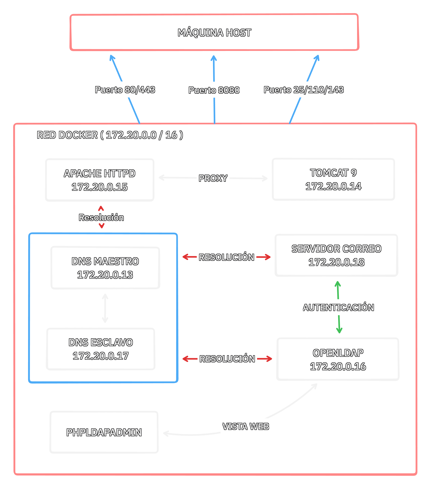

# Proyecto de Infraestructura DAW: EduTech Solutions

Este repositorio contiene la configuración completa de una infraestructura de red simulada utilizando Docker Compose. El proyecto despliega una serie de servicios interconectados que simulan un entorno empresarial real, incluyendo DNS, Servidor Web (HTTPS), Servidor de Aplicaciones, Correo y Directorio LDAP.

## Diagrama de Arquitectura y Red

La red utilizada es **172.20.0.0/16** (`red_daw`).




## Servicios Desplegados

| Servicio         | Contenedor            | IP Asignada | Puertos Expuestos | Descripción Configuración                                                                                   |
| ---------------- | --------------------- | ----------- | ----------------- | ----------------------------------------------------------------------------------------------------------- |
| **DNS Master**   | `dns_javier`          | 172.20.0.13 | 53 (UDP/TCP)      | [Ver DNS README](bind9/README.md). Maestro de zona `javier.local` y resolución inversa. Forwarder a Google. |
| **DNS Slave**    | `dns_slave_javier`    | 172.20.0.17 | 5454:53           | [Ver Slave README](bind9-slave/README.md). Réplica automática del maestro.                                  |
| **Apache**       | `apache_javier`       | 172.20.0.15 | 80, 443           | [Ver Apache README](apache/README.md). Proxy inverso SSL, Hosting Virtual, Logs centralizados.              |
| **Tomcat**       | `tomcat_javier`       | 172.20.0.14 | -                 | [Ver Tomcat README](tomcat/README.md). App Server Java. Accesible solo vía Apache.                          |
| **LDAP**         | `ldap_javier`         | 172.20.0.16 | 389, 636          | Backend de autenticación centralizada. [Ver LDAP Data](ldap_data/README.md).                                |
| **Mail**         | `mail_javier`         | 172.20.0.18 | 25, 110, 143      | [Ver Mail README](correo/README.md). Servidor SMTP/IMAP integrado con LDAP.                                 |
| **phpLDAPadmin** | `phpldapadmin_javier` | Dinámica    | 8080:80           | Interfaz web para gestión visual del directorio LDAP.                                                       |

---

## Detalles de Configuración DNS

### Zona Directa: javier.local

El servidor DNS maestro (`dns_javier` - 172.20.0.13) gestiona la zona `javier.local` con los siguientes registros:

| Nombre de Host            | Tipo              | IP Asignada       | Descripción                      |
| ------------------------- | ----------------- | ----------------- | -------------------------------- |
| `ns1.javier.local`        | A                 | 172.20.0.13       | Servidor DNS Maestro             |
| `ns2.javier.local`        | A                 | 172.20.0.17       | Servidor DNS Esclavo             |
| `tomcat.javier.local`     | A                 | 172.20.0.14       | Servidor de aplicaciones Tomcat  |
| `www.javier.local`        | A                 | 172.20.0.15       | Servidor Web Apache              |
| `ldap.javier.local`       | A                 | 172.20.0.16       | Servidor LDAP                    |
| `mail.javier.local`       | A                 | 172.20.0.18       | Servidor de correo               |
| `produccion.javier.local` | CNAME             | www.javier.local  | Alias para entorno de producción |
| `pruebas.javier.local`    | CNAME             | www.javier.local  | Alias para entorno de pruebas    |
| `@`                       | MX (Prioridad 10) | mail.javier.local | Registro de correo electrónico   |

### Zona Inversa: 0.20.172.in-addr.arpa

Resolución inversa para la red 172.20.0.0/16:

| IP          | Registro PTR                           |
| ----------- | -------------------------------------- |
| 172.20.0.13 | ns1.javier.local                       |
| 172.20.0.14 | tomcat-server.javier.local             |
| 172.20.0.15 | apache.javier.local / www.javier.local |
| 172.20.0.16 | ldap-server.javier.local               |
| 172.20.0.17 | ns2.javier.local                       |
| 172.20.0.18 | mail.javier.local                      |

### Configuración de Transferencia de Zona

- **DNS Slave** (172.20.0.17) realiza transferencia automática desde el maestro
- **Forwarders**: Consultas externas se reenvían a 8.8.8.8 (Google DNS)

---

## Configuración de VirtualHosts Apache

El servidor Apache (`apache_javier` - 172.20.0.15) está configurado con SSL/TLS y tres VirtualHosts:

### 1. VirtualHost Producción
- **Dominio**: `produccion.javier.local`
- **Puerto**: 443 (HTTPS)
- **DocumentRoot**: `/usr/local/apache2/htdocs/produccion`
- **SSL**: Habilitado con certificado autofirmado
  - Certificado: `/usr/local/apache2/conf/ssl/server.crt`
  - Clave privada: `/usr/local/apache2/conf/ssl/server.key`
- **Configuración de Directorio**:
  - `AllowOverride All` - Permite uso de .htaccess
  - `Options Indexes FollowSymLinks` - Listado de directorios y enlaces simbólicos habilitados
  - `Require all granted` - Acceso permitido sin restricciones
- **Logs**:
  - Error: `/usr/local/apache2/logs/produccion_error.log`
  - Acceso: `/usr/local/apache2/logs/produccion_access.log` (formato combined)

### 2. VirtualHost Pruebas
- **Dominio**: `pruebas.javier.local`
- **Puerto**: 443 (HTTPS)
- **DocumentRoot**: `/usr/local/apache2/htdocs/pruebas`
- **SSL**: Habilitado con el mismo certificado autofirmado
- **Configuración de Directorio**:
  - `AllowOverride None` - No se permite configuración vía .htaccess
  - `Options Indexes FollowSymLinks` - Listado y enlaces simbólicos habilitados
  - `Require all granted` - Acceso sin restricciones
- **Logs**:
  - Error: `/usr/local/apache2/logs/pruebas_error.log`
  - Acceso: `/usr/local/apache2/logs/pruebas_access.log` (formato common)

### 3. VirtualHost Tomcat (Proxy Inverso)
- **Dominio**: `tomcat.javier.local`
- **Puerto**: 443 (HTTPS)
- **Tipo**: Proxy inverso hacia contenedor Tomcat
- **SSL**: Habilitado (terminación SSL en Apache)
- **Backend**: `http://tomcat:8080/`
- **Configuración Proxy**:
  - `ProxyRequests Off` - Proxy directo deshabilitado
  - `ProxyPreserveHost On` - Mantiene el header Host original
  - `ProxyPass` y `ProxyPassReverse` - Reenvío bidireccional a Tomcat
- **Logs**:
  - Error: `/usr/local/apache2/logs/tomcat_error.log`
  - Acceso: `/usr/local/apache2/logs/tomcat_access.log` (formato combined)

### Redirección HTTP a HTTPS
Todas las peticiones HTTP (puerto 80) son redirigidas automáticamente a HTTPS (puerto 443) mediante configuración en [00-redirect.conf](apache/conf/extra/vhosts/00-redirect.conf).

---

## Usuarios y Estructura LDAP

El directorio LDAP (`ldap_javier` - 172.20.0.16) utiliza el dominio base `dc=javier,dc=local` con la siguiente estructura organizativa:

### Estructura del Directorio

```
dc=javier,dc=local
├── ou=People          (Unidad organizativa para usuarios)
└── ou=Groups          (Unidad organizativa para grupos)
```

### Usuarios Creados

Se precargan dos usuarios en el sistema mediante [bootstrap.ldif](ldap_data/bootstrap.ldif):

#### Usuario 1: Javier (Profesor)
- **DN**: `cn=Javier,ou=People,dc=javier,dc=local`
- **Clases de Objeto**: `inetOrgPerson`, `posixAccount`, `shadowAccount`
- **Atributos**:
  - `uid`: javier
  - `cn`: Javier
  - `sn`: Profe
  - `uidNumber`: 10000
  - `gidNumber`: 10000
  - `homeDirectory`: /home/javier
  - `mail`: javier@javier.local
  - `userPassword`: root

#### Usuario 2: Chopy (Alumno)
- **DN**: `cn=Chopy,ou=People,dc=javier,dc=local`
- **Clases de Objeto**: `inetOrgPerson`, `posixAccount`, `shadowAccount`
- **Atributos**:
  - `uid`: chopy
  - `cn`: Chopy
  - `sn`: Alumno
  - `uidNumber`: 10001
  - `gidNumber`: 10000
  - `homeDirectory`: /home/chopy
  - `mail`: chopy@javier.local
  - `userPassword`: example

### Acceso al Directorio LDAP

- **Puerto LDAP**: 389 (sin cifrado)
- **Puerto LDAPS**: 636 (con SSL/TLS)
- **Interfaz Web**: phpLDAPadmin disponible en http://localhost:8080
  - Usuario admin: `cn=admin,dc=javier,dc=local`
- **Integración**: El servidor de correo utiliza estos usuarios para autenticación SMTP/IMAP

---

## Instrucciones de Inicio

1. **Requisitos**: Docker y Docker Compose instalados.
2. **Arrancar entorno**:
   ```bash
   docker-compose up -d --build
   ```
3. **Verificación**:
   ```bash
   docker-compose ps
   ```

## Configuración de Cliente (Host)

Para acceder a los servicios por nombre de dominio desde tu máquina host sin usar un servidor DNS real, debes añadir entradas a tu archivo `hosts` (Windows: `C:\Windows\System32\drivers\etc\hosts`, Linux/Mac: `/etc/hosts`).

```text
127.0.0.1 produccion.javier.local
127.0.0.1 pruebas.javier.local
127.0.0.1 tomcat.javier.local
127.0.0.1 mail.javier.local
```
*Nota: Se usa 127.0.0.1 porque los puertos de Apache (443) y Mail están mapeados a localhost.*
